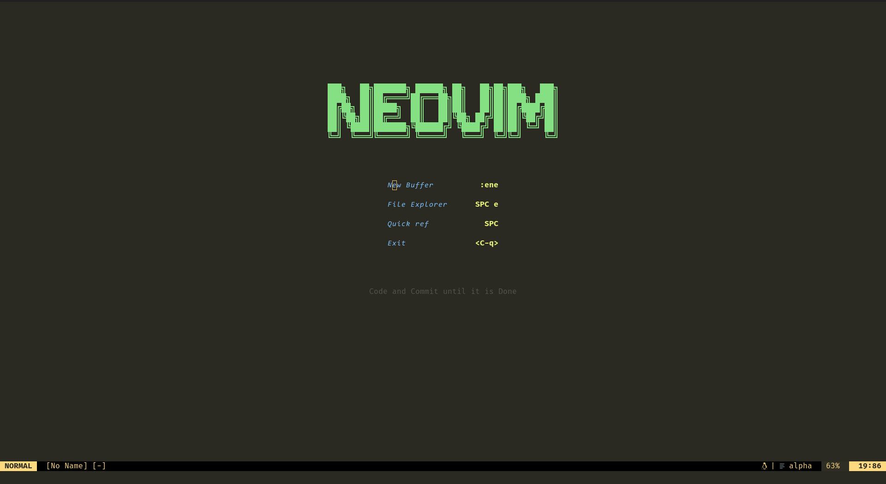
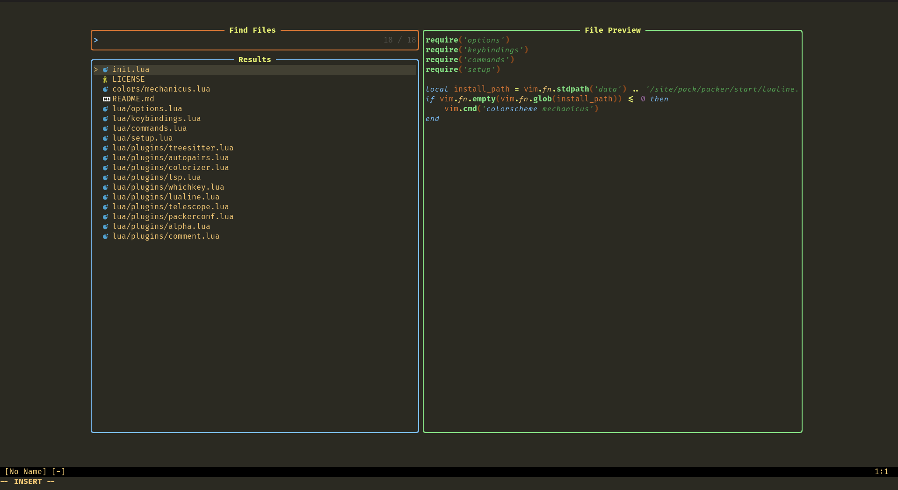
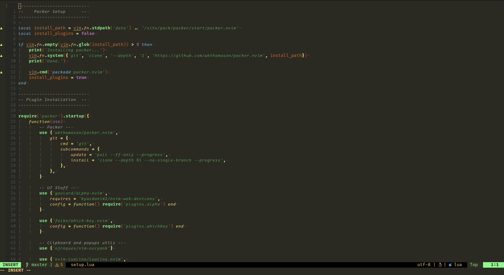
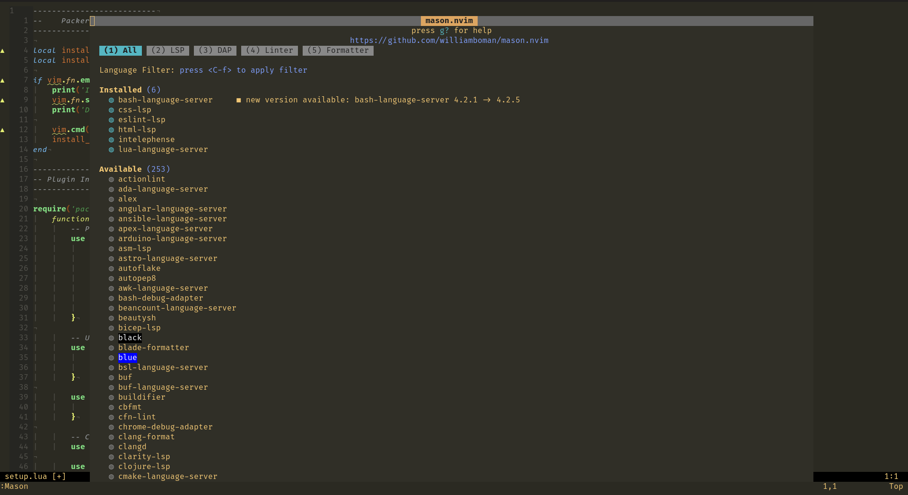

https://img.shields.io/github/last-commit/IneptusMechanicus/mechanicus.nvim?style=for-the-badge

# MECHANICUS.NVIM

This is my personal colorscheme, based off of [mechanicus-syntax](https://github.com/IneptusMechanicus/mechanicus-syntax), a syntax theme I wrote for Atom back in the day. The code of this theme is based on [tarvintin's monokai.nvim theme](https://github.com/tanvirtin/monokai.nvim), though most of the customizability and flavours have been removed.

## Installation

Installation is pretty standard for the popular package managers.

| Plugin Manager | Code |
| ----------- | ----------- |
| [Packer](https://github.com/wbthomason/packer.nvim) | `use {'IneptusMechanicus/mechanicus.nvim'}` |
| [Plug](https://github.com/junegunn/vim-plug) | `Plug 'tanvirtin/monokai.nvim'` |
