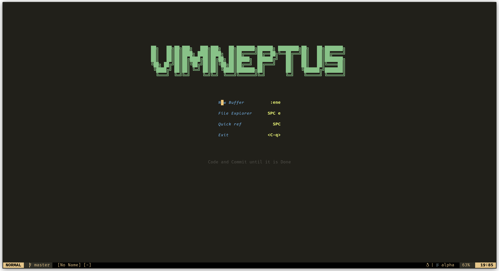
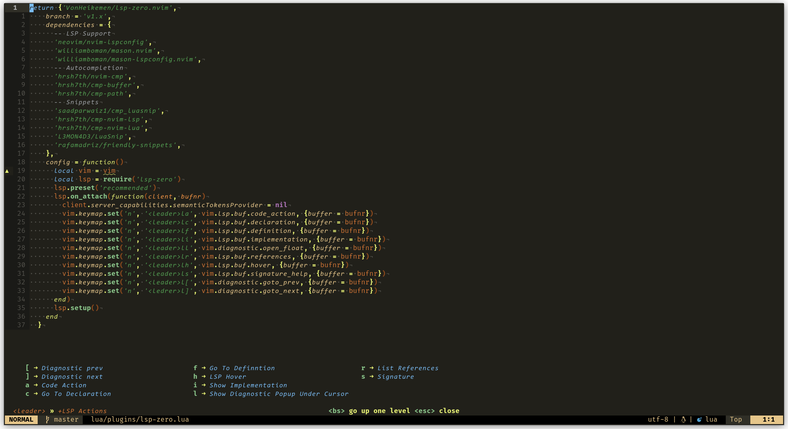
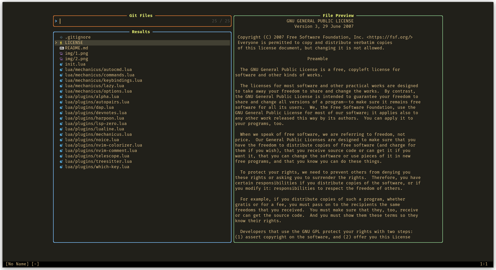
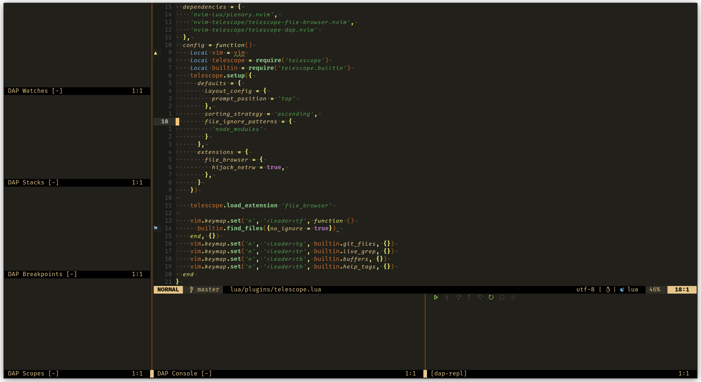

# mechanicus.nvim

This is my personal colorscheme, based off of [mechanicus-syntax](https://github.com/IneptusMechanicus/mechanicus-syntax), a syntax theme I wrote for Atom back in the day. The code of this theme is based on [tarvintin's monokai.nvim theme](https://github.com/tanvirtin/monokai.nvim), though most of the customizability and flavours have been removed.

---

    
    

    
    

---

## Installation

Installation is pretty standard for the popular package managers.

| Plugin Manager | Code |
| ----------- | ----------- |
| [Packer](https://github.com/wbthomason/packer.nvim) | `use {'IneptusMechanicus/mechanicus.nvim'}` |
| [Plug](https://github.com/junegunn/vim-plug) | `Plug 'IneptusMechanicus/mechanicus.nvim'` |

Once it's installed either invoke it inside nvim using `:colorscheme mechanicus` or using `vim.cmd()` in your Lua config

## Scope

The colorscheme covers most, but probably not all of the treesitter capture groups, I've been adding stuff as I go.
As for plugins I've implemented support for the following plugins, that I also use in [my config](https://github.com/IneptusMechanicus/neovim-config):

- [Lualine](https://github.com/nvim-lualine/lualine.nvim)
- [WhichKey](https://github.com/folke/which-key.nvim)
- [Telescope](https://github.com/nvim-telescope/telescope.nvim)
- [nvim-cmp](https://github.com/hrsh7th/nvim-cmp)

The colorscheme itself has coverd the new LSP Semantic highlights, but I keep them disabled in my own config, since I don't think that functionality is up to par yet.
